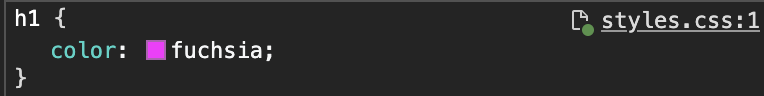

# Chrome DevTools Sources

To set up Sources so that making a changing in the inspector changes a CSS file on disk.

1. Open a web project that's served by a web server process.
2. Navigate to the `Sources` tab in the Chrome DevTools. Click the `+` icon to add your project directory.
3. Go back to the `Elements` tab and right-click and inspect an element and make a change.
    - If changing the element will save to a file, it will have a green icon next to it.

