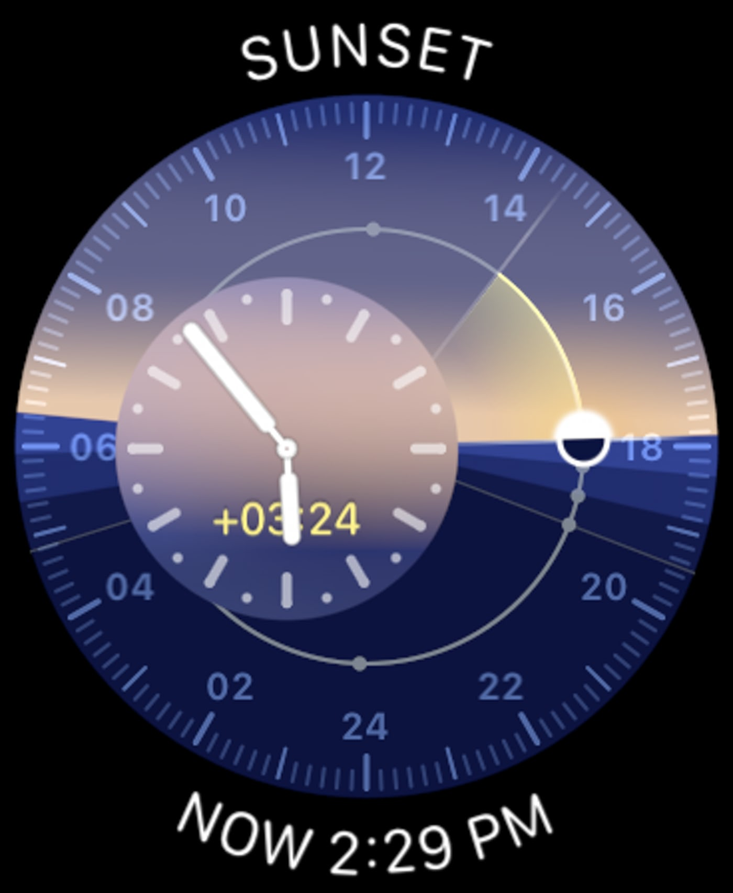
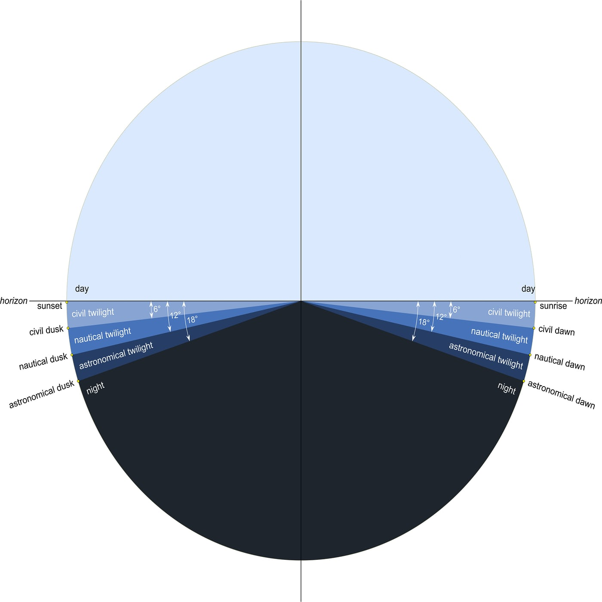

# Solar Dial

The Solar Dial consists of a 24-hour dial with 12 (noon) at the top and 24 (midnight) at the bottom. An hour hand moves once around the dial per day, and attached to the hour hand is miniature representation of the Sun.

The dots for sunset represent civil twilight, nautical twilight, and astronomical twilight, plus sunset itself.

Sunrise and sunset are defined as when the sun's disk appears above, or disappears below, the horizon.

The full sequence during sunset is:

1. Sunset
2. Civil Twilight
3. Civil Dusk
4. Nautical Twilight
5. Nautical Dusk
6. Astronomical Twilight
7. Astronomical Dusk
8. Night proper

- **Civil Twilight**: Begins at sunset and lasts until the geometric center of the sun is 6 degrees below the horizon. It's intended to define how late work can be done without resorting to artificial light. It's also sometimes used to determine whether a crime has been committed at night or not.
- **Nautical Twilight**: Begins when civil twilight ends. Nautical twilight defines when it's dark enough to start to see stars for navigation, while it's also light enough for the horizon to still be visible. Nautical twilight ends when the Sun's geometric center is 12 degrees below the horizon.
- **Astronomical Twilight**: Begins when the sun's geometric center is 12 degrees below the horizon and ends when it reaches 18 degrees below the horizon.

The top dot is Solar Noon, when the sun is at its highest point.